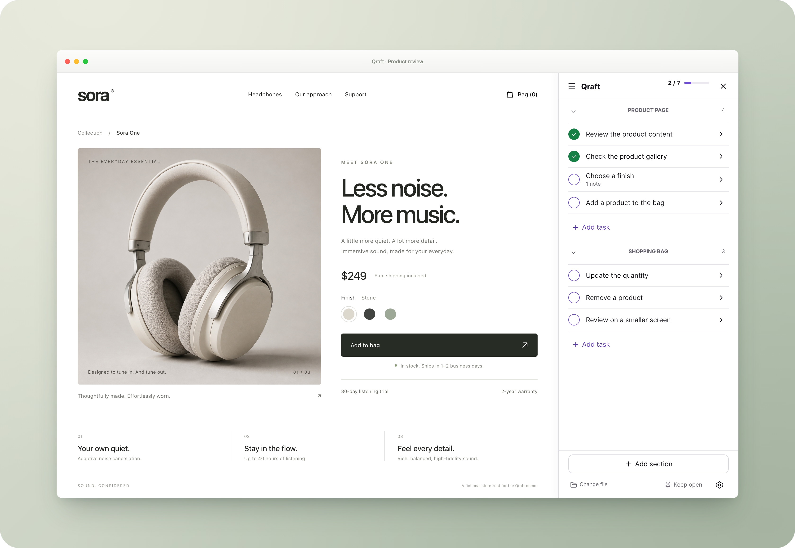
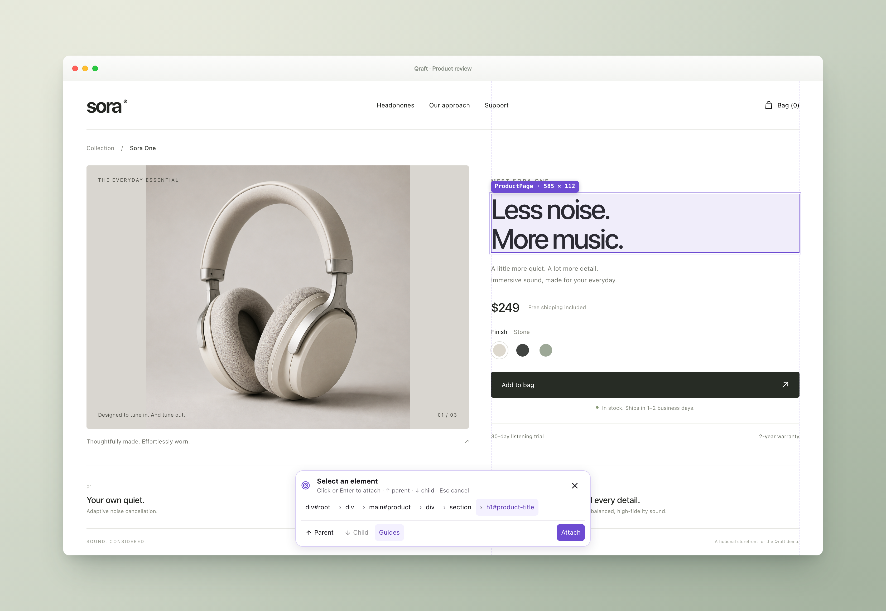

<h3 align="center">Qraft</h3>

<p align="center">Review your app without leaving it.</p>

<p align="center">
  
</p>

Turn a Markdown QA checklist into an in-app review drawer. Check your React app, attach feedback
to elements, and keep the results in a local file your coding agent can read.

Works with **Vite** and **Next.js App Router**. Development only. No account, cloud service, or API key.

[Try it](#try-the-workflow) · [Install](docs/getting-started.md) · [Create a checklist](docs/creating-checklists.md) · [Agent skill](docs/agent-skill.md)

Ask your coding agent for a QA checklist, or write one yourself. Select the Markdown file in
Qraft, then work through the tasks inside your app. Complete a check, skip it, or open it to leave
notes before moving to the next one.

When something looks off, choose **Attach element** and point to the part of the page you mean.
Qraft highlights the element and captures identifying context, including its React component and
source location when available. Your note draft stays intact while the drawer steps aside for selection.

<p align="center">
  
</p>

Your feedback goes back into the same Markdown file, ready for your coding agent to read. Completing
a task records review progress; it does not mean every observation has been fixed. Notes stay with
the task, so review progress and feedback remain together.

_Shown in a fictional local storefront. The runnable demo below uses a smaller cart example.
[See the compact mobile review](docs/assets/mobile-review.jpg)._

## Try the workflow

Clone this repository, use a [supported Node version](docs/getting-started.md#supported-environments),
and start the small local cart:

```sh
git clone https://github.com/CasperKristiansson/Qraft.git
cd Qraft
corepack pnpm install --frozen-lockfile
corepack pnpm demo
```

Open `http://127.0.0.1:5173`, click **QA**, and choose **review.local.md**. Five checks walk you
through changing quantity, attaching feedback, keyboard review, a narrow viewport, and reading the
result in your editor. The toy cart's fixed summary gives you something concrete to report.
Restarting the demo preserves your notes. Repository access is currently limited to collaborators.

To use Qraft in your own app, follow the [Vite or Next.js setup](docs/getting-started.md).
**Qraft is still private and unpublished**; installation currently uses a verified package archive.

## Start with ordinary Markdown

<!-- prettier-ignore -->
```md
# Checkout review

## Cart

- [ ] Change quantity and verify the total
  Increase and decrease quantity. The line and order totals should follow the quantity.
  - Note: The total stays at $268 when quantity increases to 3. Recalculate it when quantity changes.
- [x] Remove a product
- [-] Review an unsupported payment method
```

Sections are optional. Instructions appear in task details; notes can include element and source
context. Qraft preserves surrounding Markdown and adds hidden IDs only as needed when editing.
See the [Markdown contract](docs/markdown-storage.md) for exact syntax and preservation guarantees.

## Let your agent plan the review

Qraft includes **qraft-review**, a portable skill for initial reviews, change-focused regression
checks, focused feature reviews, and retesting earlier feedback. It keeps checks at a useful level,
orders prerequisites first, and preserves existing notes when continuing a review.

```text
Use qraft-review to create a QA checklist for the checkout changes.
The rest of the app already works. Include the current uncommitted changes,
keep this focused, and save it in reviews/checkout.md.
```

[Install the skill explicitly](docs/agent-skill.md), or run `pnpm exec qraft guide` and give its
output to your coding agent. An optional `QRAFT.md` can hold project preferences. Qraft does not
call an LLM or modify your agent configuration when installed.

## Built for a local review loop

- **Review at your pace.** Complete, skip, or reopen tasks; move directly to the next check.
- **Keep feedback specific.** Add and edit notes, with optional element, route, viewport and source context.
- **Make room for the app.** Pin the drawer, push page content on wider screens, or use the compact task strip on narrow screens.
- **Keep ownership of the file.** External edits update the drawer; stale saves surface a conflict instead of silently replacing a newer revision.

Run on a trusted local development machine. Keep the documented development guard around the
client; the adapters refuse production traffic. Element/source identification is best effort,
and physical-phone access over a network is outside the local-only scope. See
[limitations and recovery](docs/troubleshooting.md).

## Help and contributions

[Documentation](docs/README.md) · [Troubleshooting](docs/troubleshooting.md) · [Report a bug](https://github.com/CasperKristiansson/Qraft/issues/new/choose) · [Contributing](CONTRIBUTING.md) · [Security](SECURITY.md)

A small reproduction and a description of the expected behavior are useful contributions.
Qraft is [MIT licensed](LICENSE). [Third-party notices](THIRD_PARTY_NOTICES.md) cover its dependencies.

If Qraft makes your review loop easier, a star helps other developers find it.
