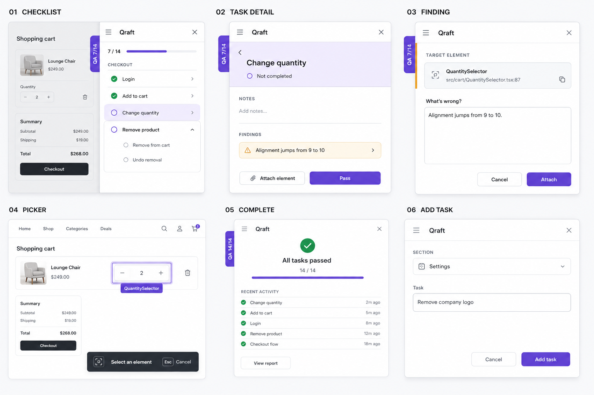

# Interaction and interface design

This document owns drawer, task-detail, picker, accessibility, and host-app interaction behavior. Product scope remains in [Product requirements](product-requirements.md).

## Approved visual baseline



Status: **Owner-approved and locked for v0.1 on 2026-09-04.**

Artifact: `docs/visuals/qraft-v0.1-visual-direction.png`

SHA-256: `ba14d7f37f19b257c521b31c5b2293f2f40a2dd69e817f65fd66d46b11315850`

The image locks the visual character and the treatment of these six surfaces:

1. checklist drawer and right-edge progress tab;
2. selected task detail;
3. element-backed finding form;
4. element-picker overlay;
5. completed-checklist state;
6. add-task form.

Implementation should reproduce its hierarchy, density, geometry, purple accent restraint, state colour semantics, and neutral surface system. The image is not a pixel measurement sheet and does not override functional, accessibility, text, or Markdown requirements in the canonical documents. When a detail is absent or ambiguous, apply the written rules below. A material visual departure requires explicit owner review and an update to this section and artifact rather than silent reinterpretation.

### Locked visual system

- Light theme only for v0.1, isolated from the host application.
- White canvas and surfaces, cool neutral hierarchy, and near-black primary ink.
- Purple `#6d4bd2` for principal action, focus, selection, progress, the edge tab, and picker identity.
- Purple hover/strong `#5b36b3`, pale purple `#f4f1ff`, pale-purple hover `#ece7ff`, and focus `#7c5ce7`.
- Green only for passed/resolved, amber only for unresolved attention, and red only for genuine errors or destructive intent.
- Approximately 10 px control radii, 40 px ordinary controls, 16 px larger panel radii, thin cool-gray borders, shallow control shadows, and deeper shadow only for floating overlays.
- Compact Inter-like system typography. Do not bundle a font in v0.1 unless browser comparison demonstrates that the platform stack materially misses the approved direction.
- List-first task presentation with separators; do not turn every task into an independent card.
- No gradients, glassmorphism, neon/glow effects, confetti, decorative illustration, or large purple surface fills.

Every implementation milestone must inspect its available surface through `@Browser`; user-visible milestones must compare the rendered result directly with this artifact.

## Design principles

1. The checklist stays visible without becoming part of the application layout.
2. The shortest successful path is select task, test, pass, continue.
3. Recording a problem adds only one extra decision: note or actionable finding.
4. Qraft must look and behave like separate developer tooling, not like the host product.
5. Error states preserve tester input and explain the recovery action.

The interaction can use familiar annotation concepts—activate, hover, select, describe—but its implementation and visual design must be original. See [Upstream and licensing](upstream-and-licensing.md).

## Closed state

A compact tab is fixed to the vertical center of the right viewport edge.

```text
┌───────────┐
│ QA 7 / 14 │
└───────────┘
```

- Progress counts passed top-level tasks over all top-level tasks.
- Findings do not change the numerator or denominator.
- The accessible name includes both the label and progress.
- Activating the tab opens the drawer and focuses its heading.

## Drawer shell

The drawer overlays the application and never resizes or shifts it.

```css
position: fixed;
inset: 0 0 0 auto;
width: min(380px, 100vw);
height: 100dvh;
z-index: 2147483647;
```

Qraft mounts within a Shadow DOM whose host is marked `data-qraft-root` and `data-react-grab-ignore`. Its CSS begins from an explicit local reset. It must not:

- change `document.body` overflow;
- write global style rules;
- inherit host typography or box sizing accidentally;
- modify the host application's width, scroll position, or focus styles.

The drawer supports desktop viewports at 768 px and above. At narrow supported widths it behaves as a modal overlay and traps focus.

## Checklist view

The checklist view contains:

- document title, defaulting to `QA`;
- passed/total progress;
- sections in file order;
- tasks in file order with status and unresolved-finding count;
- a selected-task indication;
- `Add task` within each section;
- document-level `Add section`;
- loading, parse-warning, conflict, disconnected, and write-error feedback.

Clicking a task changes only browser-local selection state. It does not mutate Markdown.

An empty or missing file shows an explanation and `Add section`. It is not created until the first successful mutation.

## Task detail

```text
← Cart

Change quantity
──────────────────────────

○ Not completed

NOTES
No notes yet.
[ + Note ]

FINDINGS
No findings yet.
[ + Finding ]  [ 🎯 Attach element ]

──────────────────────────
[ ✓ Pass ]
```

The detail view shows:

- parent section and back control;
- task title and open/passed status;
- notes in document order;
- findings in document order;
- each finding's open/resolved checkbox;
- concise element context where present;
- `Add note`, `Add finding`, `Attach element`, and `Pass` or `Reopen` actions.

### Passing and reopening

- `Pass` is disabled while any finding is unresolved.
- Its disabled explanation is: “Resolve outstanding findings before passing this task.”
- After a successful pass, select the next open task in document order.
- At the end of the document, wrap to the first open task.
- When none remain, show a completed state and keep the current task selected.
- Reopening keeps all child findings unchanged.

There is no skipped state in v0.1.

## Authoring forms

`Add section`, `Add task`, `Add note`, and `Add finding` use small in-drawer forms.

- Focus moves to the input when a form opens.
- Submit is disabled for empty or invalid content.
- `Escape` cancels the form and returns focus to its trigger.
- Submitting shows a pending state and prevents duplicate submission.
- On a revision conflict, retain the input, refresh the document, and ask the tester to review and retry.
- If the parent task disappeared, retain the text in an error state so it can be copied.
- Text may be entered in a textarea, but persisted v0.1 content is one logical paragraph: trim and collapse line breaks to spaces.

An unwanted finding cannot be deleted in v0.1. It may be marked resolved and clarified with a note.

## Element attachment flow

1. The tester selects `Attach element` from a task.
2. The drawer minimizes to a small cancel control with brief picker instructions.
3. Qraft listens for pointer movement and click in the document capture phase.
4. `getElementAtPoint()` selects a target using a filter that excludes Qraft and ignored subtrees.
5. `getElementBounds()` positions a fixed hover outline and label.
6. A click prevents default and stops propagation before the host control can act.
7. Qraft calls `getElementContext()` and opens the finding form with a compact target summary.
8. The tester describes the problem and saves the finding with the approved context fields.
9. `Escape` from picker or form cancels and restores task detail without writing.

Only one element can be attached to one finding in v0.1.

### Hover feedback

- Use a translucent fill, one-pixel outline, and small label.
- The label text falls back in this order: component name, selector, lowercase tag name.
- Keep the label inside the viewport.
- Overlay elements use `pointer-events: none`.
- Context resolution is asynchronous. Increment a request number for every pointer target and discard stale results.
- Remove every capture listener and overlay on save, cancel, component unmount, or error.

### Finding form

The form displays only context useful for recognition:

```text
QuantitySelector
src/components/cart/QuantitySelector.tsx:87

What's wrong?
┌─────────────────────────────────────┐
│ Alignment jumps from 9 to 10.       │
└─────────────────────────────────────┘

                         Cancel  Attach
```

The saved context is limited by the `ElementReference` contract in [Architecture](architecture.md). If React context resolution fails, the tester can still save a plain finding.

## Attached finding display

A finding displays:

- open or resolved state;
- body;
- component when known;
- repository-relative source location when known;
- route pathname when known;
- selector in a secondary disclosure because it can be long;
- `Open source` when a source path exists.

`Open source` calls React Grab's `openFile(source, line)`. Failure is shown inline and does not modify the checklist.

Re-highlighting a persisted selector is deferred. React Grab selectors can cross shadow roots and same-origin iframes with non-standard markers, so `document.querySelector()` is not a correct implementation.

## Status and failure states

| State | Required presentation and recovery |
| --- | --- |
| Loading | Drawer shell with non-blocking progress state. |
| Missing file | Empty checklist and `Add section`. |
| Parse warning | Known content remains usable; warning names the affected lines. |
| Duplicate ID | Affected entity is read-only; warning names ID and line numbers. |
| Disconnected SSE | Subtle persistent status; automatic reconnect and refetch. |
| Revision conflict | Preserve draft, refresh document, request review and retry. |
| Write error | Persistent message with retry; never imply the write succeeded. |
| Picker context failure | Return to form and offer a plain finding. |
| Open-source failure | Inline message and copyable source path. |

## Accessibility

- Use native buttons, headings, form labels, and checkboxes where semantics match.
- All controls are keyboard reachable with visible focus.
- Opening the drawer focuses its heading; closing returns focus to the tab.
- `Escape` closes the drawer unless a picker or form consumes it first.
- At narrow widths, trap focus inside the modal drawer.
- Announce successful mutations and errors through a polite live region.
- Express status with text or icons as well as color.
- Render checklist strings as text, never raw HTML.
- Avoid animation that ignores `prefers-reduced-motion`.

## Visual acceptance

The Playwright example must prove that opening and closing Qraft does not change the host application's measured bounding box or document scroll position. Screenshots may be used as test diagnostics, but screenshot capture is not a Qraft product feature.
